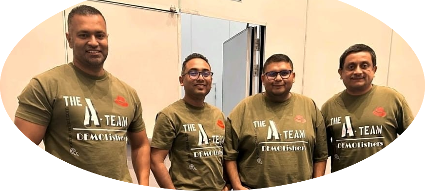

## Hi there 👋

A-Team DemoLISHERS

I am a dedicated professional, Began my career at Red Hat as an Instructor, laying the foundation for my journey with the company. Since joining in 2018, I have continually demonstrated my passion for technology and my commitment to excellence. My primary focus has been enabling partners to effectively utilize Red Hat's Ansible Automation Platform and OpenShift products, showcasing my deep expertise in these technologies.

Currently serving as a content developer, I play a pivotal role in creating demos for the Sales team, specifically focusing on Ansible Automation Platform and OpenShift. With my extensive knowledge and experience, I craft engaging and impactful demonstrations that effectively highlight the value and capabilities of these products. Additionally, I actively work on Red Hat's latest offerings, including Event-Driven Ansible and Ansible Lightspeed, which aim to revolutionize automation and enhance operational efficiency.

Find me here:
- LinkedIn: [miteshget](https://www.linkedin.com/in/miteshget/)
- Credly: [Mitesh Sharma](https://www.credly.com/users/mitesh-sharma.803b504b/badges)
- YouTube: [Linux Nerds](https://www.youtube.com/@linuxnerds3044)
